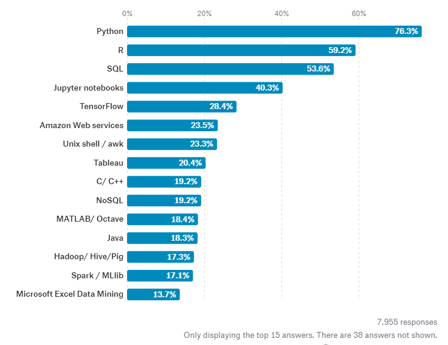

# Free and quality resources to learn data science for a complete beginner

Many free and paid resources are available online to learn data science-related topics. Here I will describe some of the freely available content in online which I myself had used and found good. So I will divide this learning plan into two levels. ie, level A and B.

# Level A
As a complete beginner, you should learn two things to improve your basics. 
* Basic statistics used in data science 
* A programming language used in the data science domain

#### Learning statistics

For learning statistics concepts I would recommend the **[youtube playlist](https://www.youtube.com/watch?v=qBigTkBLU6g&list=PLblh5JKOoLUK0FLuzwntyYI10UQFUhsY9)** provided by Josh Starmer. Go through each concept and make notes on them for easy revisions.

#### Learning python

Along with this, you should learn a programming language that is widely used in the field of data science. For this, we can choose one from R, Python, or Julia. Personally, I would recommend you to learn python because more projects in the data science field are done using python and as a result, more jobs are available for people who are trained in python.

For learning Python from scratch, you can go through this **[youtube playlist](https://www.youtube.com/watch?v=QXeEoD0pB3E&list=PLsyeobzWxl7poL9JTVyndKe62ieoN-MZ3)** provided by Telusko. I would like to tell you about a mistake that I have committed while I was learning python (which was the first general-purpose programming language I was learning in my life). I used to watch these 100+ videos without practicing/solving more real-world problems using python. But later I came to know this method is not at all productive. So, I would recommend you to practice more problems using python along with following these youtube tutorials. For practicing python problems you can use  **[hackerrank](https://www.hackerrank.com/domains/python)**. There are other platforms for coding practice like **[codestudio](https://www.codingninjas.com/codestudio/guided-paths/basics-of-python)** and **[exercism](https://exercism.org/tracks/python)**. My personal favourite is hackerrank in this scenerio. 

You should try to solve these problems yourself. If you are not able to solve the problems in hackerrank and want solutions for those problems you can check this [github repository](https://github.com/arsho/Hackerrank_Python_Domain_Solutions). But check this only after trying to solve the problems yourself for sometimes. 

# Level B

So now you must have learned very basic things that a data scientist should learn. Now you should concentrate on doing these two things simultaneously
* Learn basics of machine learning
* Solve data science problems using python notebook

#### Basics of machine learning

After reaching this level, you can start learning basic machine learning algorithms from this **[youtube playlist](https://www.youtube.com/watch?v=Gv9_4yMHFhI&list=PLblh5JKOoLUICTaGLRoHQDuF_7q2GfuJF)** provided by Josh Starmer. After covering that tutorial playlist, you can proceed to lean deep learning. For this, you can use this [youtube playlist](https://www.youtube.com/playlist?list=PLZHQObOWTQDNU6R1_67000Dx_ZCJB-3pi) provided by Grant Sanderson.

#### Python notebooks 
At this level, you can start practicing some basic ML algorithms in a python notebook. This can be done by practicing on this practice task provided by **[machinehack](https://machinehack.com/practices/machine_learning)**.

After doing these things you can try completing all other **[practice tasks](https://machinehack.com/practices)** provided by machinehack.

# Projects, projects, projects ...

Now you can start working on more real-world data science projects. Having more projects in your resume will attract more potential employers. For this, you can try being part of competitions in **[kaggle](https://www.kaggle.com/competitions)**. Based on your participation and performance in these kaggle competitions, you will get points and an overall ranking in kaggle. You can use this kaggle rank to attract potential employers and you can show these kaggle projects you have done when you are applying for internships/jobs. 
